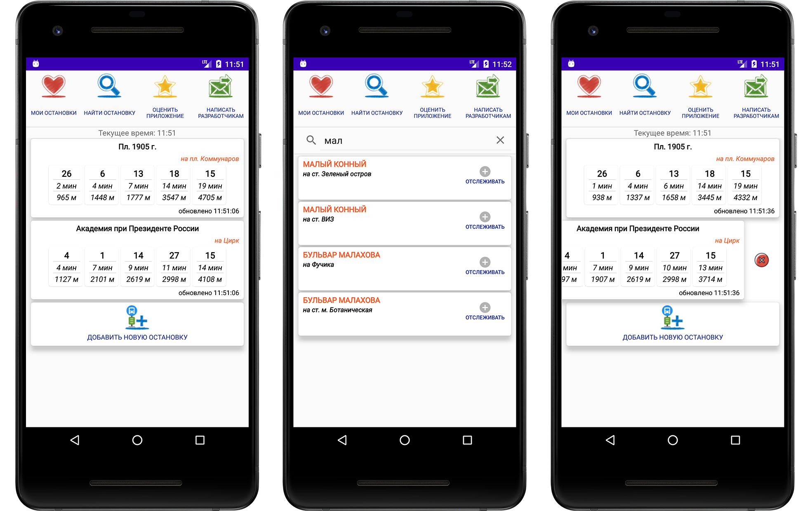
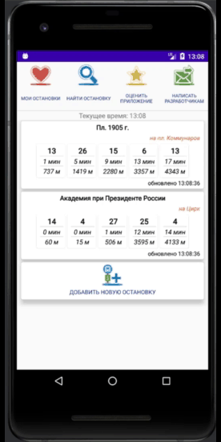
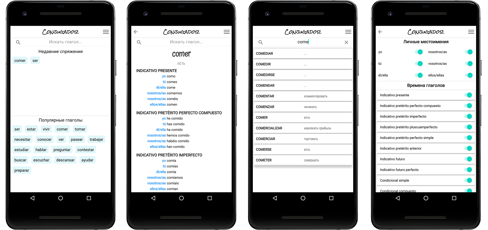
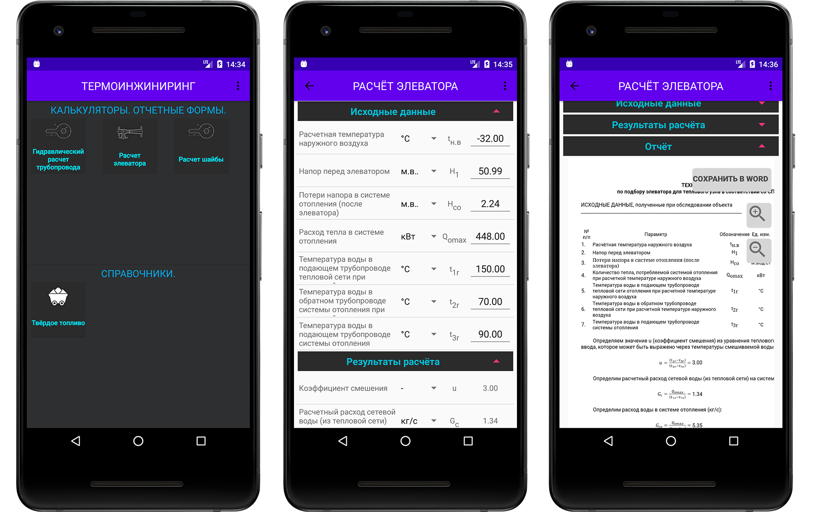
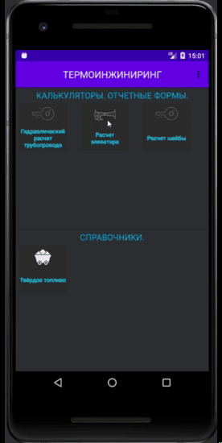
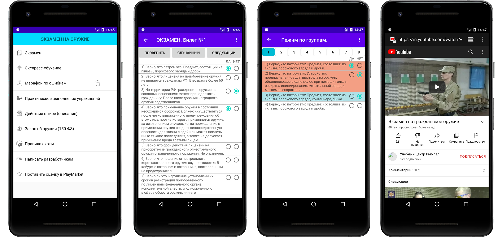

# Портфолио. APPS.JUNIPER (Юрий Сможевских)

### На данной странице представлены мои работы.
### Приведено описание разработанных приложений и перечень используемых технологий. 

&nbsp;&nbsp;&nbsp;

# HS-диаграмма (HS-diagram)

Приложение для построения процессов на HS - диаграмме и расчётов теплофизических свойств воды и водяного пара.

Основные особенности:

- Определение параметров конечных точек циклов, процессов.

- Учебные советы. Справочник по основным процессам и циклам воды и водяного пара.

- Интерактивный график - с возможностью построения основных процессов водяного пара.

- Свойства состояния: давление, температура, энтальпия, энтропия, объем, внутренняя энергия, эксергия, удельная теплоемкость.

Расчеты выполнены в соответствии с зависимостями IAPWS-IF97.

Целевая аудитория: студенты теплоэнергетических специальностей, инженерно-технические работники.

### Технологии : MVVM, Android SDK , Kotlin, Coroutines, Xml, Android Jetpack Libraries.

&nbsp;&nbsp;&nbsp;

#### Аналогичное приложение: <a href="https://play.google.com/store/apps/details?id=com.smic.whereisthetrolley">HS-диаграмма.PRO</a>

# Где трамвай? Екатеринбург.

Легкое и быстрое приложение, которое показывает точное время прибытия трамваев на остановки города Екатеринбурга.

Основные особенности:
- Автоматическое обновление информационного табло.
- Список избранных остановок.

Целевая аудитория: жители города Екатеринбурга.

### Технологии : MVVM, Android SDK , Kotlin, Coroutines, RXJava2, Dagger2, Room, Xml, Firebase, Android Jetpack Libraries.

#### Аналогичное приложение: <a href="https://play.google.com/store/apps/details?id=com.smic.whereisthetrolley">Где троллейбус? Екатеринбург</a> 

# Conjugador

Спряжения и формы большинства испанских глаголов.

Более 8000 глаголов во всех временах.
С простой навигацией и поиском.

Основные особенности:
- Найденные глаголы автоматически добавляются в список "Недавние спряжения";
- Настроика отображаемых времена и форм глаголов;
- Небольшой размер.
- Работает без Интернета.
- Основные значения глаголов на русском, английском (перевод).

Целевая аудитория: для изучающих испанский всех уровней.

### Технологии : MVVM, Android SDK , Kotlin, Coroutines, RXJava2, Dagger2, Room, Xml, Android Jetpack Libraries.

#### Аналогичное приложение: <a href="https://play.google.com/store/apps/details?id=com.smic.conjugadorit"> Italian verbs. Conjugador</a>

#  Термоинжиниринг

Приложение содержит различные теплотехнические калькуляторы и справочники.

Основные особенности:
- Типовые теплотехнические расчеты;
- Просмотр полного порядка и алгоритма расчета;
- Сохранение полученного результата в формате Microsoft Word (*.docx);

Целевая аудитория: студенты теплоэнергетических специальностей, инженерно-технические работники.

### Технологии : MVVM, Android SDK , Kotlin, Dagger2, Room, Xml.

#  Экзамен на оружие (Вымпел)

Приложение для подготовки к сдаче теоретического экзамена на Безопасное обращение с оружием в УЧЕБНОМ ЦЕНТРЕ "ВЫМПЕЛ" г. Екатеринбург.

Основные особенности:
- Полный набор вопросов для получения лицензии на владение оружием;
- Федеральный закон "Об оружии" (150-ФЗ);
- Правила охоты;
- Разделение вопросов по темам;
- Режим теоретического экзамена;
- Режим работы над ошибками;
- Видео учебный материал;

Целевая аудитория: для обучающихся безопасному обращению с оружием.
### Технологии : MVC, Android SDK , Java, Sugar, Xml.

## Спасибо, что заглянули! 
## Продолжение следует ...

Copyright 2022 APPS.JUNIPER (IURII SMOZHEVSKIKH)